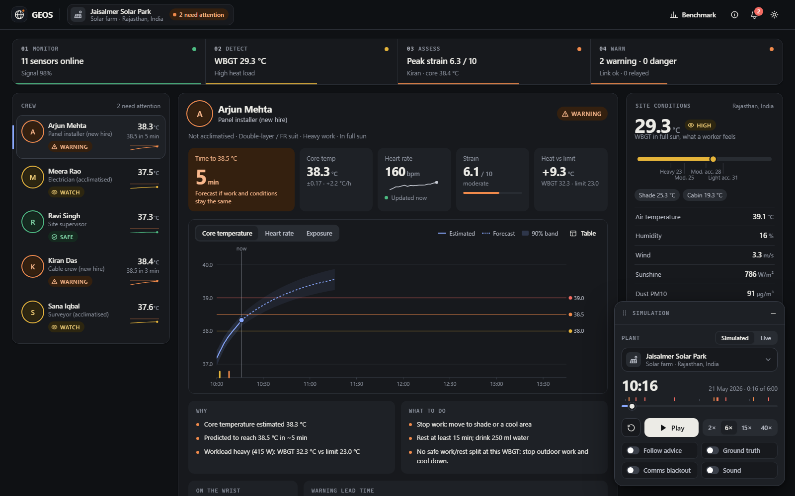
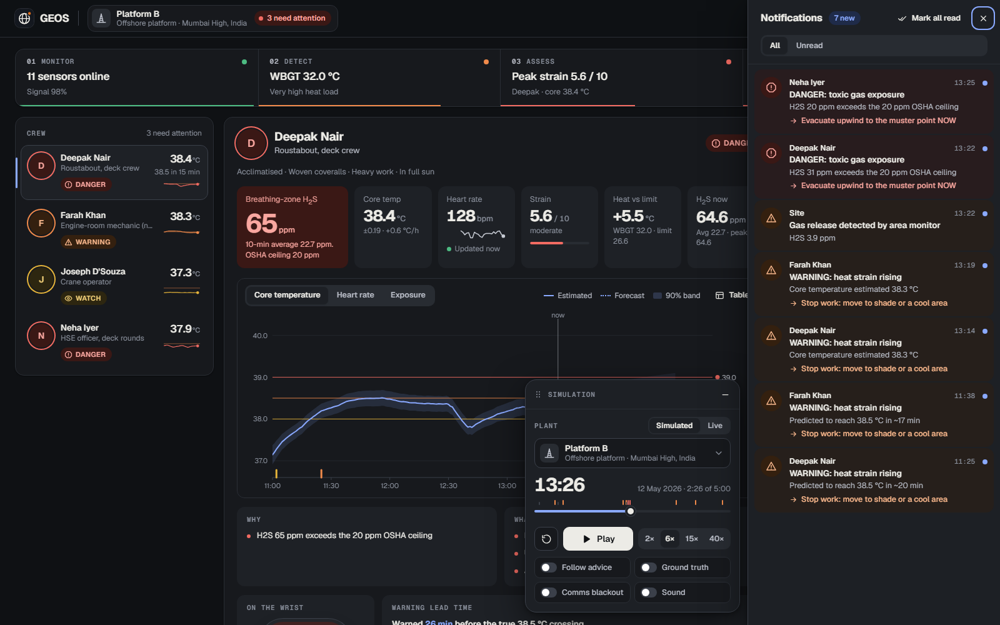

# GEOS: early warning for environmental stress

> **Environment is not exposure.** The same 42 °C afternoon endangers a new hire in a double-layer suit and not an acclimatised supervisor in the shade. GEOS works out what is happening *to each person* and warns them **before** it harms them, even with no network.

Built for **The Grand Hack: One Shared Problem, Four Ways to Solve It** (Computer Science track).
Challenge: *Monitor the environment → Detect stress → Assess human exposure → Issue an early warning.*



| Challenge stage | What GEOS does | Code |
|---|---|---|
| **Monitor** | Weather station + wearable heart rate/accelerometer + personal gas monitor, quality-checked every minute (range checks, Hampel spike filter, flat-line and dropout detection, quality score) | `engine/qc.js` |
| **Detect** | Real WBGT (Liljegren et al. 2008) per exposure zone (sun, shade, engine room, cabin) from plain weather data + sun position; CUSUM change-point detection for dust fronts, gas releases and cooling fronts | `engine/wbgt.js`, `solar.js`, `cusum.js` |
| **Assess** | Extended Kalman filter fusing an environment-driven heat-strain model (anchored to NIOSH limits) with heart rate (Buller et al. 2013) → core-temperature estimate that learns each worker's own drift; strain index (PSI), NIOSH limit for *this* person's workload, heat dose, H₂S dose | `engine/estimator.js`, `limits.js`, `strain.js`, `dose.js` |
| **Warn** | 60-minute forecast → time-to-38.5 °C with uncertainty; hysteresis state machine (SAFE/WATCH/WARNING/DANGER); every alert carries reasons and actions; fires on the device first, relays when a link exists | `engine/alerts.js`, `pipeline.js` |

## Run it

Needs [Node.js](https://nodejs.org) 20+. No `npm install` (there are no dependencies).

```bash
npm start          # dashboard at http://localhost:5173 (Windows: double-click START_DEMO.bat)
npm test           # 30 tests: physics, signal processing, alert policy, full scenarios
npm run bench      # reproduce the benchmark (writes bench/results.json + site/data/benchmark.json)
npm run snapshots  # refresh the offline weather fallback (run once while online before presenting)
```

In the app, everything about the simulation lives in the floating **Simulation** panel (bottom right; drag it anywhere, or minimise it to a circle that keeps showing progress). Pick a **plant** (Jaisalmer Solar Park, Platform B, Shaybah Oilfield, Death Valley Solar), choose a **Simulated** shift or **Live** weather from Open-Meteo, press **Play**, and click any worker. Try **Follow advice** (workers react to warnings), **Ground truth** (the simulator's true core temperature, which the engine never sees), **Comms blackout**, and the **Heat stress test** slider in Live mode. Every warning raised for a worker lands in the **Notifications** drawer (bell, top right) with an unread count, and **Benchmark** and **How it works** are in the top bar. Keys: `Space` play/pause, `R` restart, `N` notifications, `M` minimise the panel. Deep links such as `?plant=platformb&t=146&worker=deepak` jump to an exact moment.



## What the demo shows

* **Jaisalmer Solar Park (Thar Desert), 10:00-16:00.** Five workers, same weather. GEOS warns the two new hires (heavy work, double-layer suits) **28 and 50 minutes before their true core temperature crosses 38.5 °C**, and never raises a heat alarm for the three who stay safe. A static WBGT alarm rings for all five. With **Follow advice**, both peak at 38.0 °C instead of ~39 °C. A dust front at 15:00 is caught by change-point detection within 3 minutes.
* **Platform B (offshore, Mumbai High).** A sour-gas seal fails. The fixed area monitor peaks at 7.8 ppm (under the limit, "all clear") while the roustabout at the source breathes 65 ppm and is put in DANGER within 2 minutes; another worker's *10-minute dose* trips the NIOSH limit though no single reading crosses the ceiling. Meanwhile the engine-room mechanic is warned for heat in a room the outdoor sensors never see.
* **Graceful degradation.** A heart-rate strap drops out for 35 minutes (Ravi Singh, 12:30 to 13:05): the filter keeps predicting from the environment, widens its uncertainty, switches to the earliest plausible crossing time, and tells the supervisor. The heart-rate card always says how fresh its reading is ("Updated now", then "Updated 2 min ago"), turns red with "No signal" and "Last update 21 min ago" when the strap goes silent, and the crew list flags the silent strap.

## Evidence (and its limits)

600 randomised worker-shifts across 7 sites (random weather, physiology, clothing, workload, breaks), each scored against the simulator's **hidden** core temperature. Free parameters were tuned on calibration seeds 1-150 and then frozen; results are on different, held-out seeds 1000-1599. `npm run bench` reproduces them.

| Method | Warned before unsafe (≥ 38.5 °C) | ≥ 10 min early | Median head start | False alarms on clearly-safe workers |
|---|---|---|---|---|
| **GEOS** | **77%** | 65% | 26 min | **13%** |
| Static WBGT ≥ 28 °C alarm | 86% | 81% | 56 min | 78% |
| HR-only Kalman (same trigger) | 30% | 24% | 61 min | 3% |
| HR ≥ 85% of max for 5 min | 19% | 13% | 24 min | 0% |

* Core-temperature error vs truth (RMSE): **fusion 0.40 °C**, HR-only Kalman 0.46 °C, environment-only prior 0.73 °C, so fusing both beats either.
* **Closed loop** (same 150 shifts): workers reaching 38.5 °C fell **35 → 12** and reaching 39.0 °C fell **10 → 3** when they followed the advice; mean minutes above 38.5 °C fell 36.7 → 8.8.
* A static alarm catches slightly more events only by alarming 78% of people who were never in danger. HR-only methods are quiet but late. GEOS is early *and* quiet.

**Read this honestly:** the benchmark is **synthetic**. A separate heat-balance simulator (ISO 7933-style terms, sweating, dehydration, self-pacing) stands in for reality, and it was calibrated against reference conditions from the literature but is not clinical data. It shows the algorithm's logic survives noise, model mismatch, sensor dropouts and varied conditions. It is **not clinical validation**. The next step is a field pilot with logged core temperature. GEOS is decision support, not a medical device.

## How it works

State `x = [Tc, b]` (core temperature, learned per-worker drift):

```
Tc' = (Tc_eq(M, WBGT_eff) − Tc) / τ + b          prediction: environment + workload (NIOSH-anchored)
HR  = b0 + b1·Tc + b2·Tc² + activity offset       correction: Buller observation model (b0=−7887.1, b1=384.4286, b2=−4.5714, σ=18.88 bpm)
```

* `Tc_eq` rises with WBGT above the NIOSH limit for the worker's workload and acclimatisation (`RAL = 59.9 − 14.1·log10 M`, `REL = 56.7 − 11.5·log10 M`) and saturates (people self-pace).
* Without heart rate the filter just keeps predicting (uncertainty grows) instead of going blind.
* **Alert policy:** WARNING when the forecast reaches 38.5 °C within 20 min or the estimate is ≥ 38.3 °C; DANGER near 39 °C. Escalate after 3 consecutive samples (DANGER 2, acute gas 1); step down one level at a time after 12 calmer samples. When the filter is unsure it uses the *earliest plausible* crossing time.
* **Work/rest plan** is the NIOSH limit inverted for the time-weighted metabolic rate, so advice is a number ("work 30 / rest 30"), not a slogan.
* **Gas:** 10-minute rolling dose per person against NIOSH 10 ppm, OSHA 20 ppm ceiling, 100 ppm IDLH. Dust: a steady high level is a site advisory; a sudden surge is a worker alert.

Why not deep learning? It is safety-critical, there is no public labelled dataset for these settings, it must run on tiny offline devices, and every alert has to be explainable.

## Project layout

```
site/                     the app (static; deploy this folder)
  index.html styles.css flow.css sw.js manifest.webmanifest
  src/engine/             the product: dependency-free, DOM-free, O(1) per sample (1,040 lines)
  src/sim/                physiological simulator, scenarios, benchmark cohort
  src/live/openmeteo.js   real weather + offline fallback
  src/plants.js           the named plants (scripted shift and/or live weather)
  src/ui/ src/main.js     dashboard: floating simulation panel, notifications drawer, SVG charts written from scratch
  data/                   benchmark.json, snapshots.json (offline weather)
tests/                    node:test suites
bench/run.mjs             benchmark + calibration (`--tune`)
scripts/                  serve.mjs, fetch-snapshots.mjs, screenshots.ps1
docs/img/                 screenshots used in the deck
```

## Deploy the demo link (free, about 3 minutes)

The `site/` folder is plain static files. Any static host works; you need an account on the host you pick.

* **Netlify (fastest):** log in at app.netlify.com, open *Sites*, drag the `site` folder onto the "drag and drop" area. You get an `https://….netlify.app` URL.
* **GitHub Pages:** create an empty repo on github.com, then in this folder run `git init`, `git add .`, `git commit -m "GEOS"`, `git branch -M main`, `git remote add origin <your repo url>`, `git push -u origin main`. In the repo choose *Settings → Pages → Source: GitHub Actions*. The included workflow (`.github/workflows/pages.yml`) runs the tests and publishes `site/` at `https://<you>.github.io/<repo>/`.
* **Vercel / Cloudflare Pages:** import the folder and set the output directory to `site`.

After deploying: open the URL on a phone, then turn on airplane mode and reload (it should still work: it is an installable offline-capable PWA).

## Credits and data

* WBGT: independent JavaScript implementation of the model in Liljegren, Carhart, Lawday, Tschopp & Sharp (2008), *J Occup Environ Hyg* 5(10); constants follow the published algorithm (Argonne National Laboratory reference implementation).
* Core-temperature observation model and noise: Buller et al. (2013), *Physiol Meas* 34(7) (coefficients as published in US patent 10,702,165).
* Limits: NIOSH (2016) *Criteria for a Recommended Standard: Occupational Exposure to Heat and Hot Environments*; PSI: Moran, Shitzer & Pandolf (1998); H₂S limits from NIOSH/OSHA; statistics from ILO (2024), *Ensuring safety and health at work in a changing climate*.
* Live weather: [Open-Meteo.com](https://open-meteo.com/) (CC BY 4.0, free for non-commercial use).
* Clinical evaluation of ECTemp, the army algorithm that uses the same observation model: bias −0.03 ± 0.32 °C over 52,000 observations from 83 volunteers (USARIEM).
