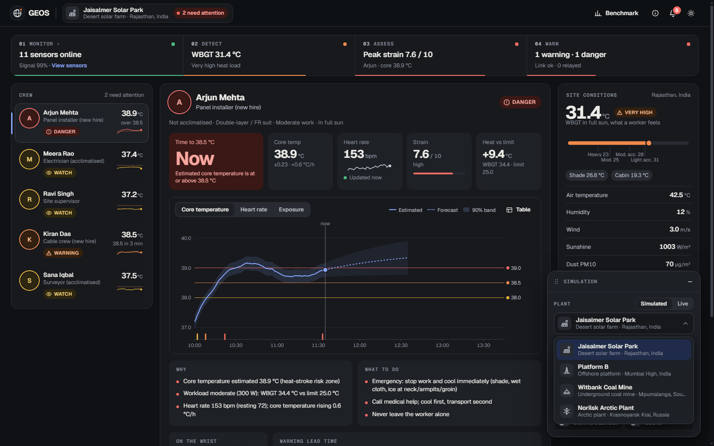
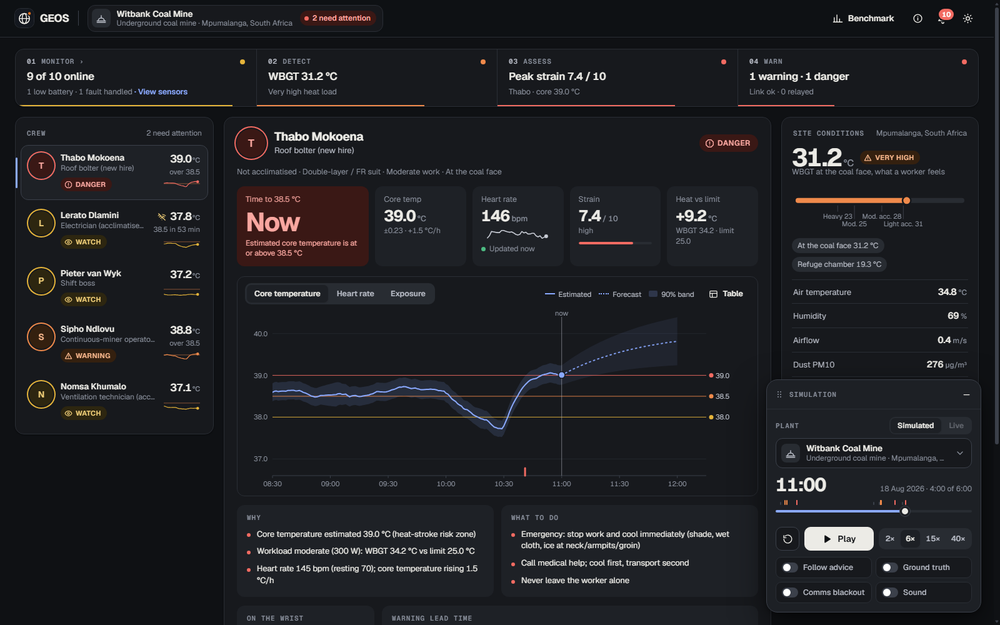
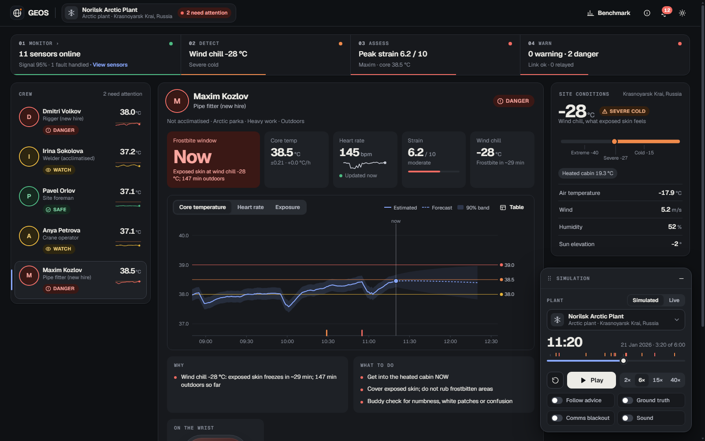
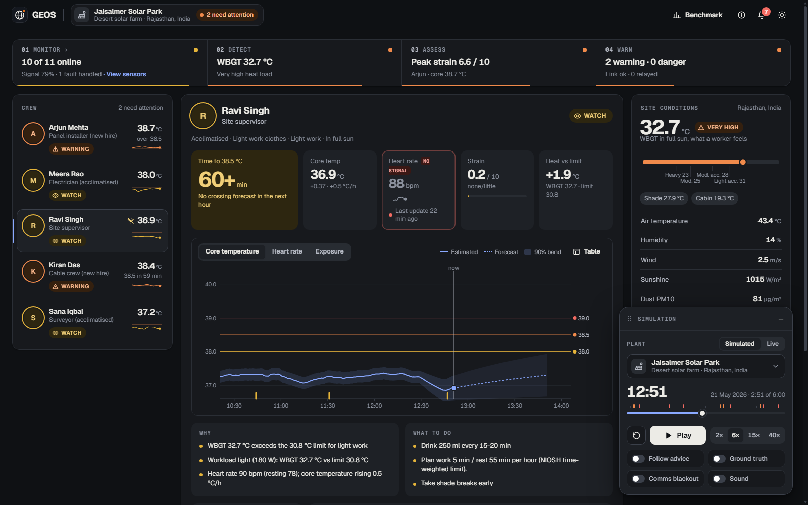
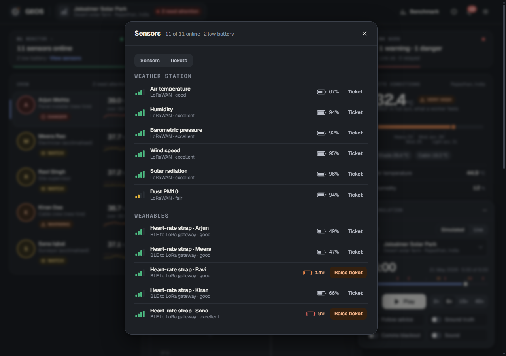
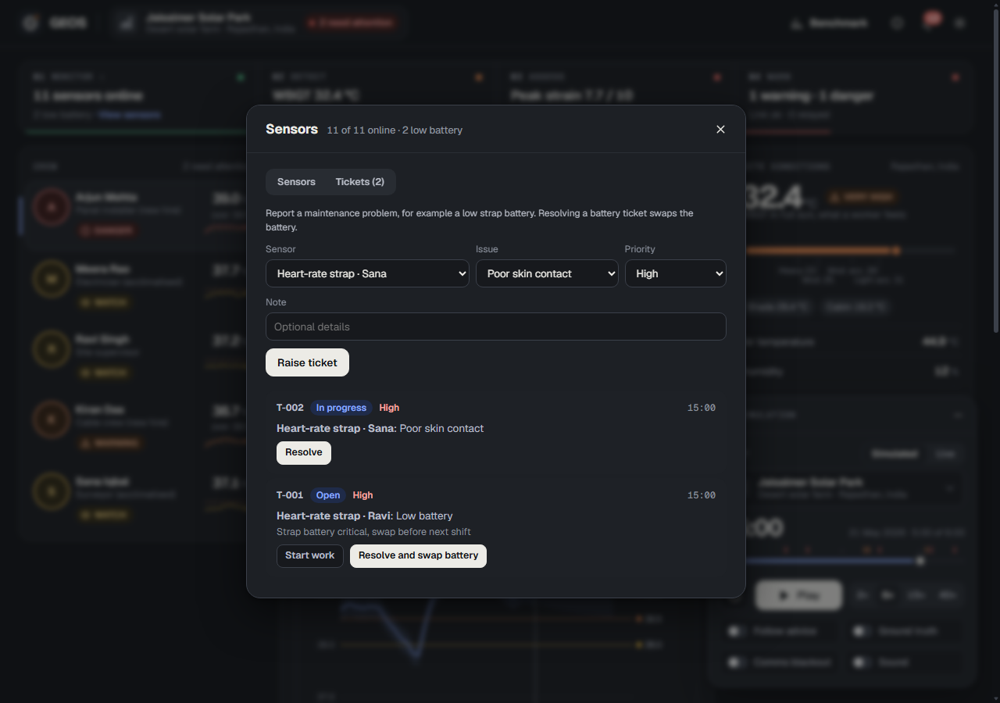
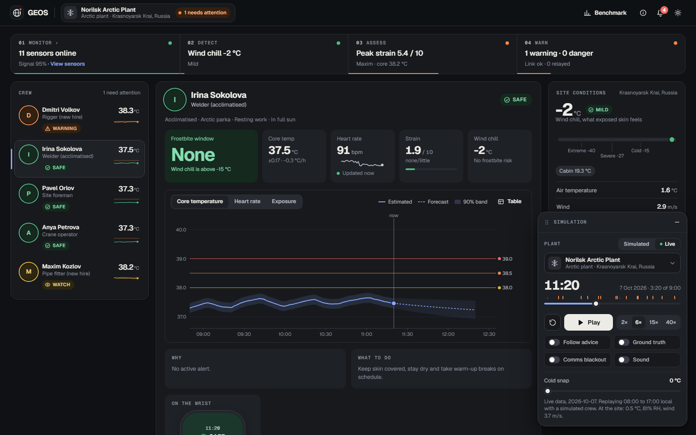
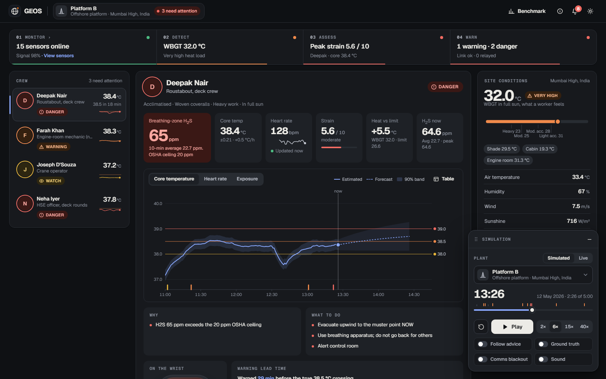
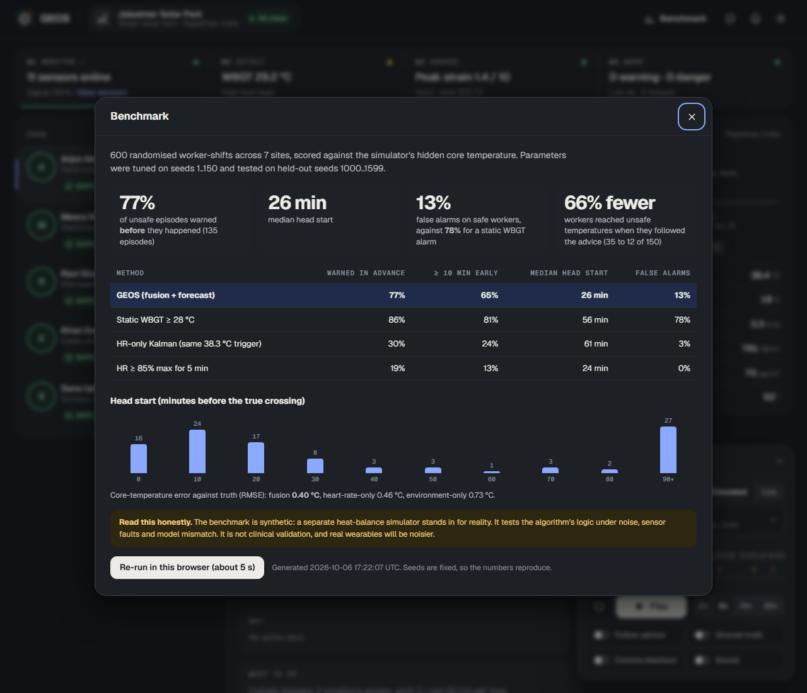
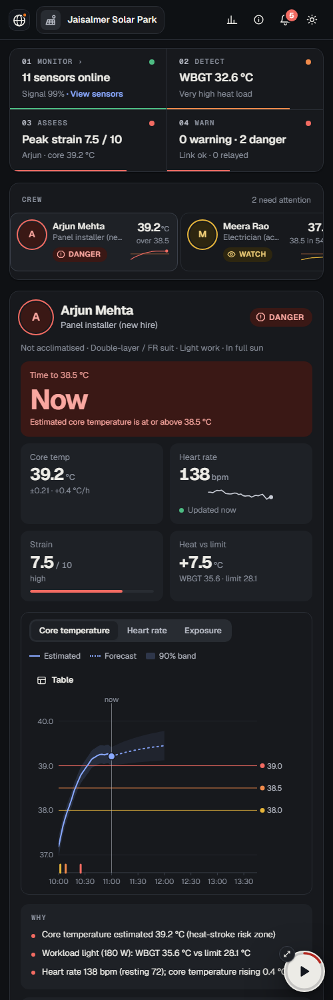

# GEOS: early warning for environmental stress

> **Environment is not exposure.** The same 42 °C afternoon endangers a new hire in a double-layer suit and not an acclimatised supervisor in the shade. GEOS works out what is happening *to each person* and warns them **before** it harms them, even with no network.

Built for **The Grand Hack: One Shared Problem, Four Ways to Solve It** (Computer Science track).
Challenge: *Monitor the environment → Detect stress → Assess human exposure → Issue an early warning.*


| Challenge stage | What GEOS does | Code |
|---|---|---|
| **Monitor** | Weather station + wearable heart rate/accelerometer + personal gas monitor, quality-checked every minute (range checks, Hampel spike filter, flat-line and dropout detection, quality score) | `engine/qc.js` |
| **Detect** | Real WBGT (Liljegren et al. 2008) per exposure zone (sun, shade, engine room, cabin) from plain weather data + sun position; CUSUM change-point detection for dust fronts, gas releases and cooling fronts | `engine/wbgt.js`, `solar.js`, `cusum.js` |
| **Assess** | Extended Kalman filter fusing an environment-driven heat-strain model (anchored to NIOSH limits) with heart rate (Buller et al. 2013) → core-temperature estimate that learns each worker's own drift; strain index (PSI), NIOSH limit for *this* person's workload, heat dose, H₂S dose | `engine/estimator.js`, `limits.js`, `strain.js`, `dose.js` |
| **Warn** | 60-minute forecast → time-to-38.5 °C with uncertainty; hysteresis state machine (SAFE/WATCH/WARNING/DANGER); every alert carries reasons and actions; fires on the device first, relays when a link exists | `engine/alerts.js`, `pipeline.js` |

## Feature tour (for judges)

Everything below is live in the demo and reproducible from the screenshots' URLs (for example `?plant=norilsk&t=200&worker=maxim`).

| | |
|---|---|
| **One shared engine, four very different sites.** Desert solar farm, offshore platform, underground coal mine and Arctic plant each have their own crew, hazards, weather and scripted shift; the same engine handles all of them. Switch from the floating panel. |  |
| **Early warning that explains itself.** Time to 38.5 °C, core-temperature estimate with a 90% band and forecast, strain, and plain-language *why* and *what to do* for every alert. Arjun is in DANGER while the supervisor is not. |  |
| **Cold stress, not just heat.** At Norilsk (-28 °C wind chill) the metric is the *frostbite window*: minutes of exposed skin left, against minutes already spent outdoors. The crane operator in the heated cab never alarms. |  |
| **Honest about stale data.** The heart-rate card shows the latest reading and how old it is ("Updated now", "Last update 22 min ago", red "No signal"); the crew list flags silent straps and the estimator keeps going from the environment, with wider uncertainty. |  |
| **Every sensor and its signal.** Click *sensors online* in the Monitor stage for each station sensor and wearable with signal bars (LoRaWAN or BLE link) and battery level. |  |
| **Maintenance tickets, especially for straps.** Low battery, no signal, poor skin contact, inaccurate readings or a damaged strap: raise a ticket (prefilled from the sensor row), track it Open → In progress → Resolved; resolving a battery ticket swaps the battery and the event lands in the notifications drawer. |  |
| **Notifications, not pop-ups.** Every warning goes to a drawer with an unread count on the bell, with reasons and actions; the simulation panel steps aside. |  |
| **Real weather, offline-safe.** *Live* mode pulls current weather from Open-Meteo and can add a heat stress test; a bundled snapshot is used if the network is down. |  |
| **Gas that the area monitor misses.** The fixed monitor reads 7.8 ppm ("all clear") while the worker at the source breathes 65 ppm and is warned within 2 minutes. |  |
| **Measured, not claimed.** A 600-shift synthetic benchmark against static and heart-rate-only baselines (see *Evidence*), open from the top bar. |  |
| **Works on a phone, offline.** Installable PWA with a service worker; the engine runs on the device so warnings do not depend on a network. |  |

More views: [full dashboard with ground truth](docs/img/dashboard-full.png) (the simulator's hidden true temperature, which the engine never sees), [warning followed vs ignored](docs/img/chart-followed.png), [how it works](docs/img/how-it-works.png).

## Run it

Needs [Node.js](https://nodejs.org) 20+. No `npm install` (there are no dependencies).

```bash
npm start          # dashboard at http://localhost:5173 (Windows: double-click START_DEMO.bat)
npm test           # 32 tests: physics, signal processing, alert policy, full scenarios
npm run bench      # reproduce the benchmark (writes bench/results.json + site/data/benchmark.json)
npm run snapshots  # refresh the offline weather fallback (run once while online before presenting)
```

In the app, everything about the simulation lives in the floating **Simulation** panel (bottom right; drag it anywhere, or minimise it to a circle that keeps showing progress). Pick a **plant**, one of each kind of site with its own crew and hazards (Jaisalmer Solar Park in the desert, Platform B offshore, Witbank Coal Mine underground, Norilsk Arctic Plant in the polar night), choose a **Simulated** shift or **Live** weather from Open-Meteo (not underground), press **Play**, and click any worker. Click **sensors online** in the pipeline strip to see every sensor with its signal bars and battery, and to raise or work **maintenance tickets** (low battery, no signal, damaged strap). Try **Follow advice** (workers react to warnings), **Ground truth** (the simulator's true core temperature, which the engine never sees), **Comms blackout**, and the **Heat stress test** slider in Live mode. Every warning raised for a worker lands in the **Notifications** drawer (bell, top right) with an unread count, and **Benchmark** and **How it works** are in the top bar. Keys: `Space` play/pause, `R` restart, `N` notifications, `M` minimise the panel. Deep links such as `?plant=platformb&t=146&worker=deepak` jump to an exact moment.


## What the demo shows

* **Jaisalmer Solar Park (Thar Desert), 10:00-16:00.** Five workers, same weather. GEOS warns the two new hires (heavy work, double-layer suits) **28 and 52 minutes before their true core temperature crosses 38.5 °C**, and never raises a heat alarm for the three who stay safe. A static WBGT alarm rings for all five. With **Follow advice**, they peak at 38.0 and 38.1 °C instead of ~39 °C. A dust front at 15:00 is caught by change-point detection within 3 minutes.
* **Platform B (offshore, Mumbai High).** A sour-gas seal fails. The fixed area monitor peaks at 7.8 ppm (under the limit, "all clear") while the roustabout at the source breathes 65 ppm and is put in DANGER within 2 minutes; another worker's *10-minute dose* trips the NIOSH limit though no single reading crosses the ceiling. Meanwhile the engine-room mechanic is warned for heat in a room the outdoor sensors never see.
* **Witbank Coal Mine (underground).** No sun, hot humid air at the face: the two new hires are warned early. A blast raises a dust surge (everyone is told to mask up), then a main-fan trip shows up as a heat-load jump.
* **Norilsk Arctic Plant.** Cold is judged by wind chill against how long each person has been outdoors (NWS frostbite times): the pipe fitter who stays out 54 minutes of every hour reaches DANGER, the crane operator in the cab never does. A blizzard front is detected as a cooling front.
* **Sensor health and maintenance.** Battery and signal are tracked per sensor; straps drain faster and two typically go low in a shift. Low ones are flagged (the Monitor stage says "2 low battery") and can be ticketed. Battery and signal values are simulated, and tickets live in the browser session only (a real deployment needs a backend).
* **Graceful degradation.** A heart-rate strap drops out for 35 minutes (Ravi Singh, 12:30 to 13:05): the filter keeps predicting from the environment, widens its uncertainty, switches to the earliest plausible crossing time, and tells the supervisor. The heart-rate card always says how fresh its reading is ("Updated now", then "Updated 2 min ago"), turns red with "No signal" and "Last update 21 min ago" when the strap goes silent, and the crew list flags the silent strap.

## Evidence (and its limits)

600 randomised worker-shifts across 7 sites (random weather, physiology, clothing, workload, breaks), each scored against the simulator's **hidden** core temperature. Free parameters were tuned on calibration seeds 1-300 and then frozen; results are on different, held-out seeds 1000-1599. `npm run bench` reproduces them.

| Method | Warned before unsafe (≥ 38.5 °C) | ≥ 10 min early | Median head start | False alarms on clearly-safe workers |
|---|---|---|---|---|
| **GEOS** | **86%** | 73% | 27 min | **8%** |
| Static WBGT ≥ 28 °C alarm | 86% | 81% | 56 min | 78% |
| HR-only Kalman (same trigger) | 36% | 31% | 65 min | 6% |
| HR ≥ 85% of max for 5 min | 19% | 13% | 24 min | 0% |

* Core-temperature error vs truth (RMSE): **fusion 0.31 °C**, HR-only Kalman 0.46 °C, environment-only prior 0.73 °C, so fusing both beats either.
* **Closed loop** (same 150 shifts): workers reaching 38.5 °C fell **35 → 10** and reaching 39.0 °C fell **10 → 2** when they followed the advice; mean minutes above 38.5 °C fell 36.7 → 4.8.
* A static alarm catches about as many events only by alarming 78% of people who were never in danger. HR-only methods are quiet but late. GEOS is early *and* quiet.

**Read this honestly:** the benchmark is **synthetic**. A separate heat-balance simulator (ISO 7933-style terms, sweating, dehydration, self-pacing) stands in for reality, and it was calibrated against reference conditions from the literature but is not clinical data. It shows the algorithm's logic survives noise, model mismatch, sensor dropouts and varied conditions. It is **not clinical validation**. The next step is a field pilot with logged core temperature. GEOS is decision support, not a medical device.

## How it works

State `x = [Tc, b]` (core temperature, learned per-worker drift):

```
Tc' = (Tc_eq(M, WBGT_eff) − Tc) / τ + b          prediction: environment + workload (NIOSH-anchored)
HR  = b0 + b1·Tc + b2·Tc² + activity offset + resting-HR offset       correction: Buller observation model (b0=−7887.1, b1=384.4286, b2=−4.5714, σ=18.88 bpm in the published model; GEOS runs σ=14 after tuning)
```

* `Tc_eq` rises with WBGT above the NIOSH limit for the worker's workload and acclimatisation (`RAL = 59.9 − 14.1·log10 M`, `REL = 56.7 − 11.5·log10 M`) and saturates (people self-pace).
* Without heart rate the filter just keeps predicting (uncertainty grows) instead of going blind.
* **Alert policy:** WARNING when the forecast reaches 38.5 °C within 20 min or the estimate is ≥ 38.2 °C; DANGER near 39 °C. Escalate after 3 consecutive samples (DANGER 2, acute gas 1); step down one level at a time after 12 calmer samples. When the filter is unsure it uses the *earliest plausible* crossing time.
* **Work/rest plan** is the NIOSH limit inverted for the time-weighted metabolic rate, so advice is a number ("work 30 / rest 30"), not a slogan.
* **Gas:** 10-minute rolling dose per person against NIOSH 10 ppm, OSHA 20 ppm ceiling, 100 ppm IDLH. Dust: a steady high level is a site advisory; a sudden surge is a worker alert.

Why not deep learning? It is safety-critical, there is no public labelled dataset for these settings, it must run on tiny offline devices, and every alert has to be explainable.

## Project layout

```
site/                     the app (static; deploy this folder)
  index.html styles.css flow.css sw.js manifest.webmanifest
  src/engine/             the product: dependency-free, DOM-free, O(1) per sample (1,040 lines)
  src/sim/                physiological simulator, scenarios, benchmark cohort
  src/live/openmeteo.js   real weather + offline fallback
  src/plants.js           the named plants (scripted shift and/or live weather)
  src/ui/ src/main.js     dashboard: floating simulation panel, notifications drawer, SVG charts written from scratch
  data/                   benchmark.json, snapshots.json (offline weather)
tests/                    node:test suites
bench/run.mjs             benchmark + calibration (`--tune`)
scripts/                  serve.mjs, fetch-snapshots.mjs, screenshots.ps1, screenshots-interactive.mjs
docs/img/                 screenshots used in this README and the deck
```

## Deploy the demo link (free, about 3 minutes)

The `site/` folder is plain static files. Any static host works; you need an account on the host you pick.

* **Netlify (fastest):** log in at app.netlify.com, open *Sites*, drag the `site` folder onto the "drag and drop" area. You get an `https://….netlify.app` URL.
* **GitHub Pages:** create an empty repo on github.com, then in this folder run `git init`, `git add .`, `git commit -m "GEOS"`, `git branch -M main`, `git remote add origin <your repo url>`, `git push -u origin main`. In the repo choose *Settings → Pages → Source: GitHub Actions*. The included workflow (`.github/workflows/pages.yml`) runs the tests and publishes `site/` at `https://<you>.github.io/<repo>/`.
* **Vercel / Cloudflare Pages:** import the folder and set the output directory to `site`.

After deploying: open the URL on a phone, then turn on airplane mode and reload (it should still work: it is an installable offline-capable PWA).

## Credits and data

* WBGT: independent JavaScript implementation of the model in Liljegren, Carhart, Lawday, Tschopp & Sharp (2008), *J Occup Environ Hyg* 5(10); constants follow the published algorithm (Argonne National Laboratory reference implementation).
* Core-temperature observation model and noise: Buller et al. (2013), *Physiol Meas* 34(7) (coefficients as published in US patent 10,702,165).
* Limits: NIOSH (2016) *Criteria for a Recommended Standard: Occupational Exposure to Heat and Hot Environments*; PSI: Moran, Shitzer & Pandolf (1998); H₂S limits from NIOSH/OSHA; statistics from ILO (2024), *Ensuring safety and health at work in a changing climate*.
* Live weather: [Open-Meteo.com](https://open-meteo.com/) (CC BY 4.0, free for non-commercial use).
* Clinical evaluation of ECTemp, the army algorithm that uses the same observation model: bias −0.03 ± 0.32 °C over 52,000 observations from 83 volunteers (USARIEM).
